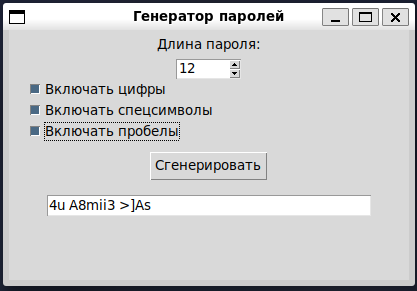

# Лабораторная работа №12

## Задание

Разработать графический интерфейс для генератора паролей

_Вы можете отходить от дизайна, но должен присутствовать обязательный функционал_

### Обязательный функционал

- Генерация пароля по длине (длина пароля должна быть фиксированная)
- Добавление в пароль специальных символов, пробелов и чисел

_Если галочка стоит, то должен быть минимум 1 символ данного типа, однако все равно должны преобладать буквенные значения_

## Референс

